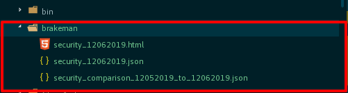

# Blame Brakeman

Brakeman is a static analysis tool which checks Ruby on Rails applications for security vulnerabilities.

Blame Brakeman: "git blame" added JSON warnings.

    {
    "user_input": null,
    "confidence": "Medium",
    "blame": "xxxxxxxxxxxxx (developer_name 2019-07-17 20:59:12 +0530 4226)  params.require(:users).permit!\r\n"
    }

# Installation

Using RubyGems:

    gem install blame_brakeman

Using Bundler:

    group :development do
      gem 'blame_brakeman'
    end

# Steps

1. First install brakeman gem in project
    
    `gem install brakeman`
    
2. Then install

    `gem install blame_brakeman` (OR) `gem 'blame_brakeman'`
    
3. require 'blame_brakeman'

4. Class Details are below 

     `blame = BlameBrakeman::BrakemanSecurity.new('git'); blame.brakeman_security`
     
5. After, You will get a security_warning file under `root_directory/brakeman`. 

6. OutputFolder Structure

# Conditions

1. If Yesterday, security_file is not there. It will generate today's security_file `security_MMDDYYYY.json`
2. If Yesterday, security_file is there. It will compare Yesterdays file and Todays file. It will give a output like 
   `security_comparison_YESTERDAY(MMDDYYYY)_to_TODAY(MMDDYYYY).json`
3. Sample Output:

          {
            "warning_type": "Mass Assignment",
            "warning_code": 70,
            "fingerprint": "",
            "check_name": "MassAssignment",
            "message": "Parameters should be whitelisted for mass assignment",
            "file": "app/controllers/user_controller.rb",
            "line": 4226,
            "link": "https://brakemanscanner.org/docs/warning_types/mass_assignment/",
            "code": "params.require(:users).permit!",
            "render_path": null,
            "location": {
              "type": "method",
              "class": "UsersController",
              "method": "users_params"
            },
            "user_input": null,
            "confidence": "Medium",
            "blame": "xxxxxxxxxxxxx (developer_name 2019-07-17 20:59:12 +0530 4226)  params.require(:users).permit!\r\n"
          }

   
# Compatibility

It will work all the ruby versions and rails versions.

# Building

    git clone git://github.com/honestveera/blame_brakeman.git
    cd blame_brakeman
    gem build blame_brakeman.gemspec
    gem install blame_brakeman*.gem

# Who is Using Brakeman?

* [Code Climate](https://codeclimate.com/)
* [GitHub](https://github.com/)
* [Groupon](http://www.groupon.com/)
* [New Relic](http://newrelic.com)
* [Twitter](https://twitter.com/)

[..and more!](http://brakemanscanner.org/brakeman_users)

# Homepage/News

Website: http://brakemanscanner.org/

Twitter: https://twitter.com/brakeman
